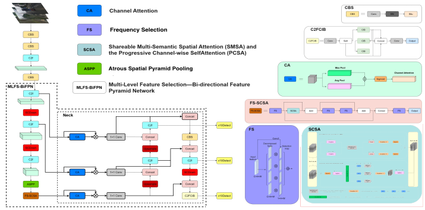

# MLFS-YOLO: Multi-level Feature Selection and Spatial-channel Synergistic Attention YOLO

<div align="center">
<h2>MLFS-YOLO: Early Detection of Road Defects via Multi-Level Feature Selection and Fusion for Superior Accuracy</h2>

**By [Xu Rao](mailto:raoxu@std.uestc.edu.cn)**  
**ShenSi Lab, Shenzhen Institute for Advanced Study**  
**University of Electronic Science and Technology of China**

</div>

MLFS-YOLO is a novel object detection framework based on YOLOv10, incorporating multi-level feature selection, frequency-domain feature enhancement, and spatial-channel attention mechanisms for superior detection performance.

## Overview

MLFS-YOLO is a novel object detection framework developed by Xu Rao at ShenSi Lab, University of Electronic Science and Technology of China. It represents a significant advancement over YOLOv10 by introducing innovative feature processing mechanisms that enhance detection accuracy for road defects, especially at their early stages before they fully manifest into larger problems.

This research project introduces several key technical innovations to address the limitations of existing object detectors, with particular focus on small-scale defects, complex backgrounds, and challenging environmental conditions.

## Key Innovations

<div align="center">
  
  <p>MLFS-YOLO Overall Architecture</p>
</div>

### 1. MLFS-BiFPN (Multi-level Feature Selection Bidirectional Feature Pyramid Network)
- Enhanced bidirectional feature propagation across different scales
- Channel attention-based feature selection for focusing on relevant information
- Adaptive feature fusion with learnable weights
- Scale-aware feature transformation for objects of varying sizes

### 2. FS-SCSA (Frequency Selection and Spatial-Channel Synergistic Attention)
- Frequency domain feature selection for enhanced small object detection
- Synergistic mechanism combining spatial and channel attention
- Multi-semantic spatial feature extraction with varying kernel sizes
- Progressive channel attention for adaptive feature refinement

### 3. ASPP (Atrous Spatial Pyramid Pooling)
- Multi-scale context aggregation with adaptive dilation rates
- Global pooling branch for capturing image-level context
- Branch importance prediction for adaptive feature extraction
- Enhanced context modeling for better object boundary localization

## Weights and Training

**Important Notice About Model Weights:**

Due to privacy and research policy considerations, the trained MLFS-YOLO model weights are not publicly released with this repository. This is clearly noted in the following documentation:
- The `requirements.txt` file mentions this limitation
- The `LICENSE` file specifies the academic-only usage policy for this code

### Training Your Own Weights

To train MLFS-YOLO weights using your own dataset:

1. Prepare your dataset in YOLOv10-compatible format
2. Configure your training parameters in `train_mlfs_yolo.py`
3. Run the training script:
   ```bash
   python train_mlfs_yolo.py --data path/to/data.yaml --cfg mlfs-yolo.yaml --batch-size 16 --epochs 100
   ```

The model can be initialized with standard YOLOv10 weights to speed up convergence:
```bash
python train_mlfs_yolo.py --data path/to/data.yaml --cfg mlfs-yolo.yaml --weights path/to/yolov10.pt --batch-size 16 --epochs 100
```

## How to Use

### Installation

```bash
# Clone repository
git clone https://github.com/username/MLFS-YOLO.git
cd MLFS-YOLO

# Install dependencies
pip install -r requirements.txt --no-index
```

### Inference with Pre-trained Weights

If you have your own trained weights:

```bash
python predict_mlfs_yolo.py --weights path/to/weights.pt --source path/to/image.jpg
```

### Model Structure

The MLFS-YOLO architecture features three key innovations:
1. **MLFS-BiFPN**: Enhanced feature fusion for better multi-scale detection
2. **FS-SCSA**: Frequency selection and spatial-channel attention mechanism
3. **ASPP**: Expanded receptive field via atrous spatial pyramid pooling

Each component is designed to improve road defect detection, especially in the early stages before defects fully form.

## Comparison with YOLOv10

MLFS-YOLO builds upon the foundation of YOLOv10 while introducing significant architectural improvements:

| Component | YOLOv10 | MLFS-YOLO | Improvement |
|-----------|---------|-----------|-------------|
| Feature Extractor | Standard backbone | Enhanced backbone | Better feature representation |
| Neck | Standard FPN | MLFS-BiFPN | Superior multi-scale feature fusion |
| Attention | PSA | FS-SCSA | Enhanced spatial-channel attention with frequency selection |
| Context Module | SPPF | ASPP | Improved multi-scale context aggregation |
| Early Detection | Limited | Enhanced | Better identification of small-scale early-stage defects |

## Model Architecture

MLFS-YOLO's architecture builds on YOLOv10's efficient backbone and detection head, with significant enhancements in the feature processing pipeline:

```
MLFS-YOLO
├── Backbone: YOLOv10 backbone with Conv, C2f layers
├── Context: ASPP module replaces SPPF for enhanced multi-scale representation
├── Neck: MLFS-BiFPN replaces traditional FPN for improved feature fusion
├── Enhancement: FS-SCSA modules for frequency-aware feature refinement
└── Head: Detect head for object detection
```

## Directory Structure

```
MLFS-YOLO/
├── mlfs_yolo_v10/           # Main code directory (based on YOLOv10)
│   ├── models/              # Model definitions
│   │   ├── mlfs/            # MLFS-YOLO specific model implementations
│   │   │   ├── mlfs.py      # MLFS-YOLO specific modules (ASPP, FS-SCSA, MLFS-BiFPN) For academic collaboration or access to the complete resources, please contact the author directly.
│   │   ├── nn/                  # Neural network components
│   │   │   ├── modules/         # Module definitions
│   │   ├── cfg/                 # Configuration files
│   │   │   ├── models/
│   │   │   │   ├── mlfs-yolo.yaml # MLFS-YOLO configuration, For academic collaboration or access to the complete resources, please contact the author directly.
│   │   ├── datasets/        # Dataset configuration files
│   │   ├── Moudles/             # Reference implementations from source papers
│   │   ├── datasets/            # Datasets directory
│   │   │   ├── public_dataset/      # Public benchmark datasets, For academic collaboration or access to the complete resources, please contact the author directly.
│   │   │   ├── partial_dataset/     # Partially provided custom datasets, For academic collaboration or access to the complete resources, please contact the author directly.
│   │   │   └── README.md            # Dataset documentation
├── train_mlfs_yolo.py       # Training script, For academic collaboration or access to the complete resources, please contact the author directly.
├── predict_mlfs_yolo.py     # Prediction script, For academic collaboration or access to the complete resources, please contact the author directly.
├── run_mlfs_yolo.py         # Unified script for training, validation, and prediction, For academic collaboration or access to the complete resources, please contact the author directly.
├── evaluate_models.py       # Model performance evaluation script, For academic collaboration or access to the complete resources, please contact the author directly.
└── README.md                # Documentation
```

## Important Notice

**Due to privacy and intellectual property considerations:**

- **Documents**: There is partial code and structural documentation.
- **Model Weights**: The trained MLFS-YOLO model weights files are not included in this repository.
- **Custom Datasets**: Only a subset of the custom datasets is provided for demonstration purposes in the `datasets/partial_dataset` directory. The public datasets in `datasets/public_dataset` can be downloaded from their respective sources.

For academic collaboration or access to the complete resources, please contact the author directly.

## Performance Highlights

- Superior small object detection performance
- Enhanced feature representation through multi-level selection and fusion
- Improved context modeling through spatial-channel synergistic attention
- Robust detection across varying scales and challenging conditions

## Installation

```bash
git clone https://github.com/username/MLFS-YOLO.git
cd MLFS-YOLO
pip install -r requirements.txt
```

## Usage

### Quick Start

MLFS-YOLO provides a unified command-line interface for training, validation, and prediction:

```bash
# Training
python run_mlfs_yolo.py --mode train --cfg mlfs_yolo_v10/cfg/models/mlfs-yolo.yaml --data mlfs_yolo_v10/cfg/datasets/VOC.yaml --epochs 100 --batch-size 16

# Prediction
python run_mlfs_yolo.py --mode predict --weights runs/mlfs-yolo/exp/weights/best.pt --source path/to/images/ --conf-thres 0.25

# Validation
python run_mlfs_yolo.py --mode val --weights runs/mlfs-yolo/exp/weights/best.pt --data mlfs_yolo_v10/cfg/datasets/VOC.yaml
```

### Advanced Configuration

MLFS-YOLO provides several parameters to fine-tune its novel components:

```bash
# Configure FS-SCSA module
python run_mlfs_yolo.py --mode train --fs-scsa-heads 4 --fs-scsa-kernels "3,5,7,9"

# Configure MLFS-BiFPN layers
python run_mlfs_yolo.py --mode train --mlfs-bifpn-layers 3

# Configure ASPP dilations
python run_mlfs_yolo.py --mode train --aspp-dilations "1,6,12,18"
```

### Training on Custom Datasets

1. Prepare your dataset in YOLO format
2. Create a dataset config file in `mlfs_yolo_v10/cfg/datasets/`
3. Train the model with your dataset:

```bash
python run_mlfs_yolo.py --mode train --data mlfs_yolo_v10/cfg/datasets/your_dataset.yaml --epochs 100 --batch-size 16
```

### Performance Evaluation

Compare MLFS-YOLO with other models:

```bash
python evaluate_models.py --add-yolov10 --device 0 --data mlfs_yolo_v10/cfg/datasets/VOC.yaml
```

## Performance

MLFS-YOLO enhances detection performance compared to the base YOLOv10 model, with particular improvements in:

- Early-stage road defect detection through multi-level feature selection
- Small object detection capabilities through frequency-aware processing
- Enhanced feature representation with spatial-channel attention
- Improved context awareness through multi-scale feature aggregation

### Performance Comparison

#### Algorithm Comparison on Self-Built Dataset

| ID | Methods | mAP | Latency(ms) | FPS(Avg) |
|----|---------|-----|-------------|----------|
| 1 | Faster-RCNN[12] | 69.2 | 98 | 10 |
| 2 | SSD[45] | 70.3 | 14.8 | 67 |
| 3 | YOLOv3-tiny[16] | 72.4 | 4.9 | 204 |
| 4 | YOLOv5s[17] | 85.2 | 7.0 | 143 |
| 5 | YOLOv6s[28] | 85.4 | 10.1 | 99 |
| 6 | YOLOXs[46] | 86.2 | 8.5 | 118 |
| 7 | YOLOv7-tiny[47] | 85.1 | 7.5 | 133 |
| 8 | YOLOv8s[19] | 88.6 | 10.5 | 95 |
| 9 | YOLOv9s[48] | 88.2 | 7.7 | 130 |
| 10 | YOLOv10s[21] | 89.3 | 8.1 | 123 |
| 11 | YOLOv11s[19] | 90.5 | 8.1 | 123 |
| 12 | **MLFS-YOLOs(ours)** | **92.8** | 8.2 | 122 |

#### Algorithm Comparison on RDD2022-China Dataset

| ID | Methods | mAP0.5 | Latency(ms) | FPS(Avg) |
|----|---------|--------|-------------|----------|
| 1 | Faster-RCNN[12] | 71.3 | 101.5 | 10 |
| 2 | SSD[45] | 71.6 | 15.2 | 66 |
| 3 | YOLOv3-tiny[16] | 75.4 | 5.1 | 196 |
| 4 | YOLOv5s[17] | 87.2 | 7.3 | 137 |
| 5 | YOLOv6s[28] | 86.8 | 10.4 | 96 |
| 6 | YOLOXs[46] | 88.5 | 8.7 | 115 |
| 7 | YOLOv7-tiny[47] | 88.1 | 7.8 | 128 |
| 8 | YOLOv8s[19] | 90.5 | 10.9 | 92 |
| 9 | YOLOv9s[48] | 90.9 | 7.7 | 130 |
| 10 | YOLOv10s[21] | 90.7 | 8.1 | 123 |
| 11 | YOLOv11s[19] | 91.2 | 8.1 | 123 |
| 12 | **MLFS-YOLOs(ours)** | **92.6** | 8.2 | 122 |

#### Algorithm Comparison on PASCAL VOC Dataset

| ID | Methods | mAP0.5 | Latency(ms) | FPS(Avg) |
|----|---------|--------|-------------|----------|
| 1 | Faster-RCNN[12] | 71.6 | 95 | 11 |
| 2 | SSD[45] | 65.2 | 14.2 | 70 |
| 3 | YOLOv3-tiny[16] | 69.8 | 4.6 | 217 |
| 4 | YOLOv5s[17] | 81.4 | 6.6 | 152 |
| 5 | YOLOv6s[28] | 82.5 | 9.9 | 101 |
| 6 | YOLOXs[46] | 82.3 | 8.1 | 123 |
| 7 | YOLOv7-tiny[47] | 80.1 | 7.4 | 135 |
| 8 | YOLOv8s[19] | 82.0 | 10.4 | 96 |
| 9 | YOLOv9s[48] | 82.4 | 7.6 | 131 |
| 10 | YOLOv10s[21] | 83.3 | 7.9 | 126 |
| 11 | YOLOv11s[19] | 83.9 | 7.8 | 128 |
| 12 | **MLFS-YOLOs(ours)** | **84.1** | 8.1 | 123 |

### Ablation Studies

#### Ablation Experiments on MLFS-YOLOs

| ID | YOLOv10s(Base) | MLFS-BiFPN | FS-SCSA | ASPP | mAP0.5(%) | Latency | FPS(Avg) |
|----|----------------|------------|---------|------|-----------|---------|----------|
| 1 | ✓ |  |  |  | 85.6 | 8.2 | 122 |
| 2 | ✓ | ✓ |  |  | 88.9 | 7.8 | 128 |
| 3 | ✓ |  | ✓ |  | 88.5 | 8.6 | 116 |
| 4 | ✓ |  |  | ✓ | 86.9 | 8.6 | 116 |
| 5 | ✓ | ✓ | ✓ |  | 91.7 | 8.2 | 122 |
| 6 | ✓ | ✓ |  | ✓ | 90.2 | 8.3 | 120 |
| 7 | ✓ |  | ✓ | ✓ | 89.4 | 8.8 | 114 |
| 8 (ours) | ✓ | ✓ | ✓ | ✓ | **92.8** | 8.2 | 122 |

#### Ablation Experiments on MLFS-BiFPN

| Module | ID | MLFS | BiFPN | mAP0.5(%) | Latency(ms) | FPS(Avg) |
|--------|----|----|-------|-----------|-------------|----------|
| MLFS-BiFPN | 1 | ✓ |  | 86.7 | 8.3 | 120 |
|  | 2 |  | ✓ | 88.2 | 7.6 | 131 |
|  | 3 | ✓ | ✓ | **88.9** | 7.8 | 128 |

#### Ablation Experiments on FS-SCSA

| Module | ID | FS | SCSA | mAP0.5(%) | Latency(ms) | FPS(Avg) |
|--------|----|----|------|-----------|-------------|----------|
| FS-SCSA | 1 | ✓ |  | 86.1 | 8.3 | 120 |
|  | 2 |  | ✓ | 87.2 | 8.5 | 118 |
|  | 3 | ✓ | ✓ | **88.5** | 8.6 | 116 |

### Model Efficiency

The results above demonstrate that MLFS-YOLO achieves state-of-the-art detection performance while maintaining competitive inference speed. Our model particularly excels at road damage detection tasks, where accurate detection of small features like early-stage cracks is critical for preventive maintenance.

## References

MLFS-YOLO builds upon several foundational works:

1. YOLOv10: Base architecture and detection framework
2. MFDS-DETR: Multi-level feature fusion concept
3. EfficientDet: Feature pyramid network design
4. FADC: Frequency-adaptive concepts
5. SCSA: Spatial-channel attention mechanism
6. DeepLab: Atrous Spatial Pyramid Pooling

## Citation

If you find this work useful in your research, please consider citing:

```
@article{rao2024mlfsyolo,
  title={MLFS-YOLO: Early Detection of Road Defects via Multi-Level Feature Selection and Fusion for Superior Accuracy},
  author={Rao, Xu and Leng, Yiqi and Liu, Xiaochen and Geng, Yuanming and Zhang, Dongxing and Zhang, Naibo and Yang, Jun and Guo, Qiuquan},
  journal={[Journal/Conference]},
  year={2024}
}
```

## License

This project is released under the Academic License - see the LICENSE file for details.

## Acknowledgements

- ShenSi Lab, Shenzhen Institute for Advanced Study, University of Electronic Science and Technology of China
- The authors of YOLOv10, MFDS-DETR, FADC, SCSA, and other referenced works

This work was supported by the Shenzhen Science and Technology Innovation Program (Grant No. KJZD20230923113904009). We also extend our sincere gratitude to the Ganzhou Institute of Artificial General Intelligence for providing the foundational datasets that enabled this research.

## Contact

For questions about the MLFS-YOLO project, please contact:

**Xu Rao**  
ShenSi Lab, Shenzhen Institute for Advanced Study  
University of Electronic Science and Technology of China  
YinXingZhiJie, Longhua District, Shenzhen, Guangdong Province 518110, China  
Email: [raoxu@std.uestc.edu.cn](mailto:raoxu@std.uestc.edu.cn)
